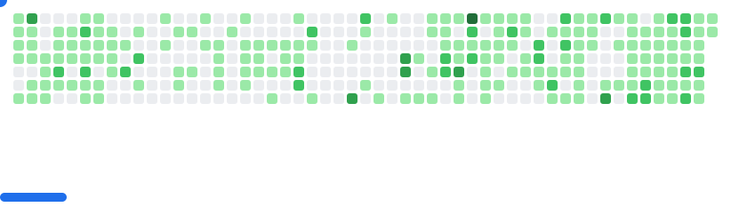

  

  

# 👋 Hi! I'm Bibek Adhikari
### 🚀 Full-Stack Web & Mobile Developer | 🌍 Nepal | 💰 FinTech Enthusiast

I build **scalable web & mobile applications**, craft clean UX, and explore **AI/ML integrations** for real-world solutions, especially in **financial tech, automation, and data-driven apps**.

 

  
  
  
  

---

## 💡 Core Expertise

* **Full-Stack Development:** Expert in the MERN/PERN stack and robust Python backends (Django, NestJS, Node.js).
* **Mobile Development:** Cross-platform development using **Flutter** and **React Native**.
* **FinTech & Automation:** Specializing in building secure, scalable financial technology and data-driven automation tools.
* **AI/ML Integration:** Utilizing frameworks like **TensorFlow, PyTorch, YOLO, and LangChain** for real-world application features.
* **DevOps & Cloud:** Hands-on experience with **Docker, Kubernetes, AWS, and CI/CD** for deployment and scalability.

---

## 🛠️ My Tech Stack

### 💻 Languages & Frameworks

  
  
  
  
  
  
  
  
  
  
  

### 🗄️ Databases & DevOps

  
  
  
  
  
  
  
  

### 🤖 AI/ML & Data Science

  
  
  
  
  
  
  

---

## 🤝 Let's Connect & Collaborate

I'm actively looking for exciting opportunities and collaborations on projects involving **Full-Stack, Mobile, AI/ML, and FinTech**.

* **Portfolio:** [bibekadhikari18.com.np](https://www.bibekadhikari18.com.np)
* **LinkedIn:** [Bibek Adhikari](https://www.linkedin.com/in/bibek-adhikari-6438521b1/)
* **Email:** info@bibekadhikari18.com.np

> ☕ Fun fact: Coding with a cup of coffee is my superpower!

## 🎮 GitHub Breakout (Live Contributions Game)  

  <picture>
    <source media="(prefers-color-scheme: dark)" srcset="images/breakout-dark.svg" />
    <source media="(prefers-color-scheme: light)" srcset="images/breakout-light.svg" />
    
  </picture>

💬 Always open for collaborations and discussions — drop me an email or connect on LinkedIn!  
